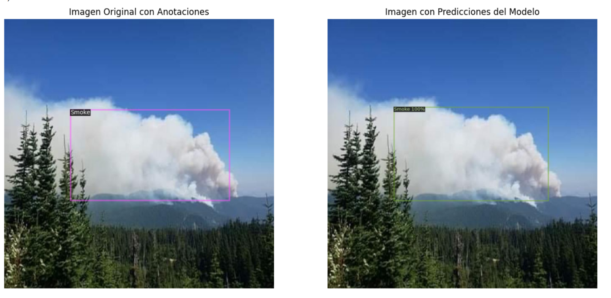

# CEIA - Visión por computadora 2 - Co16 2024

### Integrantes del equipo:

* a1604 | Federico Arias Suárez | f_ariassuarez@hotmail.com
* a1618 | Myrna Lorena,Degano | myrna.l.degano@gmail.com
* a1620 | Gustavo Julián Rivas | gus.j.rivas@gmail.com
## Objetivo:

Implementar un modelo de detección de incendios a través de visión por computadora.

## Conjunto de datos

https://universe.roboflow.com/myworkspace-iraqv/wildfire_full  
 
* <u>Tipo de problema a resolver</u>: Detección de objetos.  
 
* <u>Objetivo</u>: Detectar focos de incendio.  
 
* <u>Motivación</u>: La Amazonía se está quemando a un ritmo alarmante, afectando el clima, la biodiversidad y el calentamiento global.
Detectar incendios de manera temprana podría marcar la diferencia para evitar daños mayores.

* <u>Créditos</u>:  

 - **title**: Wildfire_Full Dataset
 - **type**: Open Source Dataset
 - **author**: MyWorkspace
 - **URL**: https://universe.roboflow.com/myworkspace-iraqv/wildfire_full
 - **published**: Roboflow Universe
 - **publisher**: Roboflow
 - **year**: 2024
 - **month**: oct

* [Análisis exploratorio de los datos](Dataset_EDA/)

## Arquitecturas

Se exploraron y realizaron experimentos con diferentes arquitecturas y configuraciones sobre el conjunto de datos propuesto.

* [VGG16](Modelo_VGG16)

* [VGG16](Resnet_SSD_50_Tensorflow)

* [Retinanet](Retinanet)

* [Yolov8](Modelo_YOLOV8)

## Resultados y conclusiones finales

* [Resumen TO DO](XXXX)

 
 

